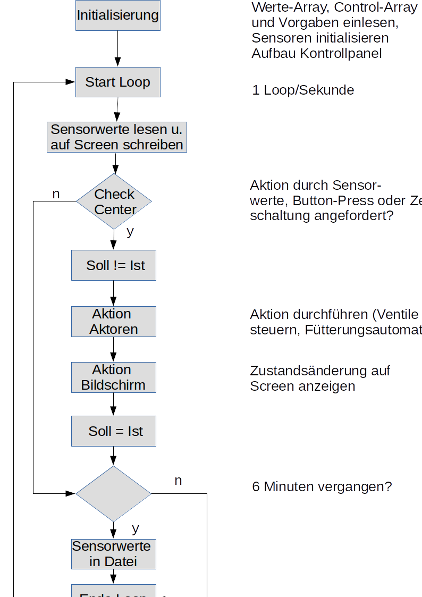

# Aquaponik_Steuerung

Das Programm steuert einen Raspberry Pi, der in einem Aquaponik CHOP-System zum Einsatz kommt.

# Realstruktur

Das Besondere an der Anlage, die in einem 50 qm-Gewächshaus installiert ist, ist die Kombination mit
normalen Erd-Hochbeeten

Da hier Regenbogenforellen gezüchtet werden sollen, braucht es für den Sommer eine Kühlung der Fischtanks. Diese soll
durch frisches Brunnenwasser (13 Grad Celsius) erfolgen, das anschließend zur Bewässerung der Erd-Hochbeete genutzt wird.

Die Erde in den Hochbeete wird mit Feuchtigkeitssensoren kontrolliert. Falls die Erde zu feucht ist, wird das Kühlungswasser verieselt.

Folgende Sensoren sind im Einsatz: 

- 6 Erdfeuchtesensoren über MCP3008
- 5 Temperatursensoren über Wire-1
- 1 Lux-Messer zur Überwachung der Lichtintensität (über I2C-Bus)
- 1 Ph-Sensor von Atlas Scientific zur Ph-Messung in den Fischtanks (über UART)
- 1 Ultraschallsensor zur Messung der Wasserhöhe im Sumptank

Die Pumpe im Sumptank ist eine Geysir-Pumpe, die mit Luft betrieben wird. Zur Heizung des Wassers im Winter kann die Luft von 
unterm Dach angesaugt werden.

Wenn das nicht reicht, kann eine Wasserheizung gestartet werden.

Aktoren sind:
- die Hauptpumpe (eine Luftpumpe, die eine Geysirpump betreibt)
- 2 Luftfventile (Luft von unten/oben)
- 5 Wasserventile
- 12-Volt Motor für Fütterungsautomat

Alle Aktoren werden über GPIOs und zwei Relais-Boards gesteuert.

Hier die Struktur des kombinierten Aquaponik-Erdhochbeet-Systems:

# Konfiguration des Raspberry Pi

zum Auslesen der Temperatursensoren
in /boot/config.txt eingetragen:          dtoverlay = w1-gpio
                                          gpiopin=4
     
für den Lichtsensor und die Hardwareclock (tiny RTC)
muss man in raspi-config unter Interface Options den I2C Bus aktivieren

Für die Nutzung des Analog zu Digital-Chips MCP3008 ist die SPI-Schnittstelle zu aktivieren

# Struktur des Programms

Hier die grobe Struktur des Programms

