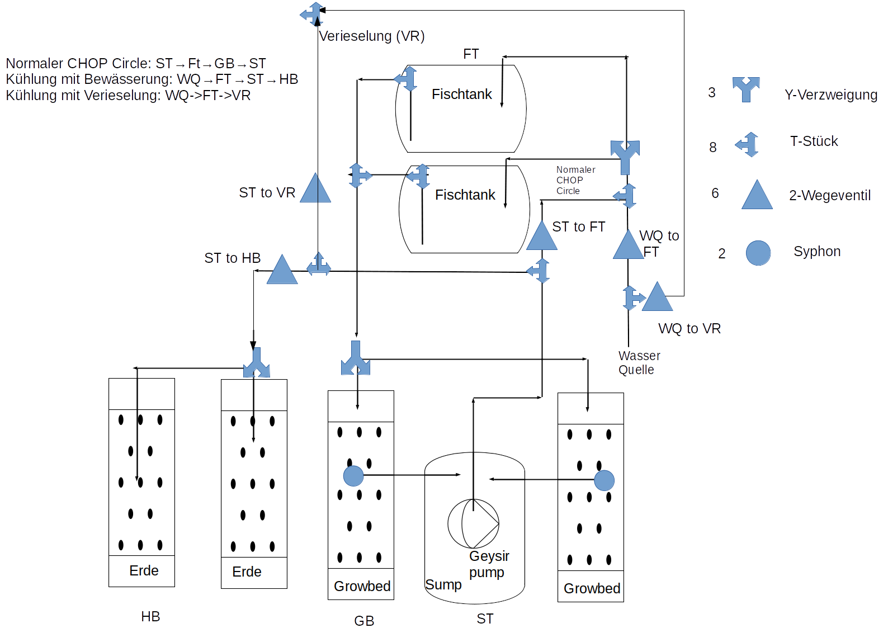
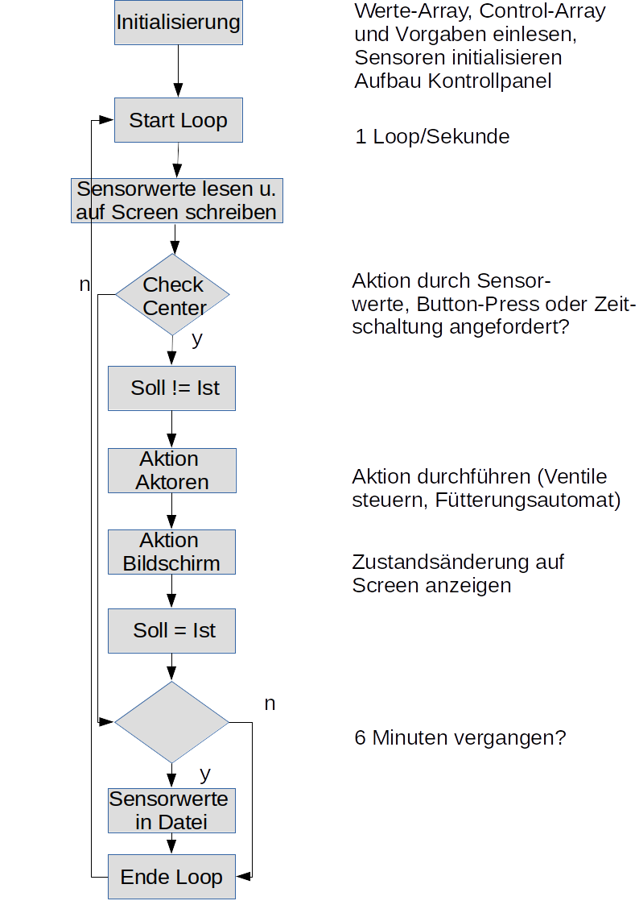

# Aquaponik_Steuerung

Das Programm steuert einen Raspberry Pi, der in einem Aquaponik CHOP-System zum Einsatz kommt.

# Realstruktur

Das Besondere an der Anlage, die in einem 50 qm-Gewächshaus installiert ist, ist die Kombination mit
normalen Erd-Hochbeeten

Da hier Regenbogenforellen gezüchtet werden sollen, braucht es für den Sommer eine Kühlung der Fischtanks. Diese soll
durch frisches Brunnenwasser (13 Grad Celsius) erfolgen, das anschließend zur Bewässerung der Erd-Hochbeete genutzt wird.

Die Erde in den Hochbeete wird mit Feuchtigkeitssensoren kontrolliert. Falls die Erde zu feucht ist, wird das Kühlungswasser verieselt.

Folgende Sensoren sind im Einsatz: 

- 6 Erdfeuchtesensoren über MCP3008
- über MCP3008 wird auch die Spannung der 12-Volt Batterie überwacht.
- 5 Temperatursensoren über Wire-1
- 1 Lux-Messer zur Überwachung der Lichtintensität (über I2C-Bus)
- 1 Ph-Sensor von Atlas Scientific zur Ph-Messung in den Fischtanks (über UART)
- 1 Ultraschallsensor zur Messung der Wasserhöhe im Sumptank

Die Pumpe im Sumptank ist eine Geysir-Pumpe, die mit Luft betrieben wird. Zur Heizung des Wassers im Winter kann die Luft von 
unterm Dach angesaugt werden.

Wenn das nicht reicht, kann eine Wasserheizung gestartet werden.

Aktoren sind:
- die Hauptpumpe (eine Luftpumpe, die eine Geysirpump betreibt)
- 2 Luftfventile (Luft von unten/oben)
- 5 Wasserventile
- 12-Volt Motor für Fütterungsautomat

Alle Aktoren werden über GPIOs und zwei Relais-Boards gesteuert.

Hier die Struktur des kombinierten Aquaponik-Erdhochbeet-Systems:

# Konfiguration des Raspberry Pi

zum Auslesen der Temperatursensoren
in /boot/config.txt eingetragen:          
dtoverlay = w1-gpio
gpiopin=4
     
Für den Lichtsensor und die Hardwareclock (tiny RTC)
muss man in raspi-config unter Interface Options den I2C Bus aktivieren

Für die Nutzung des Analog zu Digital-Chips MCP3008 ist die SPI-Schnittstelle zu aktivieren

# Programmstruktur

Hier die grobe Struktur des Programms

# Besonderheiten des Programms (1): Steuerung mit Arrays

Das Programm wird im Wesentlichen über drei Arrays gesteuert (die technisch gesehen Dictionaries sind):

- der Vorgabe-Array 
- der Werte-Array
- der Control-Array

## Vorgabe-Array

Der Array mit Vorgabewerten definiert Grenzwerte für Sensordaten. Im Programm sind Bedingungen definiert,
ab wann automatisch eine Aktion ausgelöst wird, z.B. Temperatur Wasser > 23 Grad -> Kühlung
Am Schluß werden noch Fütterungszeit und -dauer festgelegt.
Die Werte werden als Entry-Vorgaben auf dem Screen gezeigt, können also geänderte werden (Abschluß: Return).
Bei Beendigung des Programms werden die Werte gespeichert und bei Neustart aufgerufen.

vw         =  {  
"TempWasserMin" : 3,     	  Temperatur in den Fischtanks  
"TempWasserMax" : 23,  		
"TempLuftMin"   : 3,    	    Temperatur im Gewächshaus unten  
"WasserpegelMin": 0,    	   Wasserspiegel im Sumpftank  
"WasserpegelMax": 0,		
"PhWertMin"     : 6.7,		  
"PhWertMax"     : 7.1,  		
"Fuetterung"    : 10.00,  	
"Fuett.dauer"  : 5}  		
                 
               
## Werte-Array

Der Werte-Array beinhaltet die ausgelesenen Sensordaten, bzw. die errechneten Daten für Sonnenauf- und -untergang 

wa          = {"T_Luft_oben" : 0,      Lufttemperatur unterm Dach des Gewächshauses, kann zum Heizen eingesetzt werden 
               "T_Luft_unten" : 0,     Lufttemperatur unten
               "T_Wasser1": 0,         Temperatur Fischtank 1
               "T_Wasser2": 0,         Temperatur Fischtank 2
               "T_aussen": 0,          Außentemperatur
               "Luxwert_1" : 0 ,       Luxwert
               "Ph-Wert": 0 ,          Ph-Wert Wasser
               "Sauerstoff" : 0,       O2-Gehalt Wasser (muß noch entschieden werden, ob das sinnvoll ist)
               "Volt"  :0 ,            Spannung der 12-Voltbatterie
               "Wasserstand" : 0,      Wasserstand im Sumptank 
               "Sonnenaufgang": 0,     wird von sunset.py auf der Grundlage von GPS und Datum ausgerechnet
               "Sonnenuntergang": 0,   die Luxdaten werden nur am Tag gespeichert
               "Erdfeuchte1" : 0,      Erdfeuchtmessung in den Erd-Hochbeeten
               "Erdfeuchte2" : 0,       
               "Erdfeuchte3" : 0,       
               "Erdfeuchte4" : 0,
               "Erdfeuchte5" : 0,
               "Erdfeuchte6" : 0
                }

## Control-Array

Der Kontrollarray ca entält links die IST-, in der Mitte oder rechts  die SOLL-Zustände.
([0,1] heißt: das Item (z.B. ein Ventil) ist aus/zu soll aber an/aufgemacht werden.
Da wo das Item dreistellig ist, indizierte der letzte Wert, ob ein manual override vorliegt. Der Grund dafür ist,
dass eine Zustandsänderung sowohl durch definierte Sensordaten als auch manuell über den Bildschirm angefordert werden kann.
Beispiel: die if-clauses für die Sensordaten sagen: "normaler CHOP-Circle", über den Bildschirm wurde
aber "Kühlung mit Bewässerung" gewählt. Dann darf das nicht im nächsten Loop durch die Sensorbedingungen
rückgängig gemacht werden, sondern muß entgegen der definierten Bedingungen aufrechterhalten werden,
bis wieder eine manuelle Abschaltung über den Bildschirm erfolgt.

Die ersten fünf Items sind komplexe Zustände, da mehrere Ventile gleichzeitig gesteuert werden müssen.

ca          ={ "normaler CHOP-Circle":     [0,0,0],  normaler Betrieb (FT -> GB -> ST ->FT) wobei Luft von unten
               "warmer CHOP-Circle":       [0,0,0],  warmer Betrieb (FT -> GB -> ST ->FT) wobei Luft von unterm Dach
               "Kühlung mit Bewässerung":  [0,0,0],  zugeführtes Brunnenwasser wird zur Bewässerung der Erdbeete genutzt
               "Kühlung mit Verieselung":  [0,0,0],  dito mit Verieselung
               "Brunnenwasser als Heizung":[0,0,0],  Brunnenwasser hat 15 Grad, kann auch zum "Heizen" eingesetzt werden
               "Wasser auffüllen":         [0,0,0],  Wasserverlust muss ausgeglichen werden
               "Wasser ablassen":          [0,0,0],  zuviel Wasser im System
               "Hauptpumpe":               [0,0,0],
               "Screen_schreiben":         [0,1,0],  Sensorwerte auf Screen schreiben, kann im Dauerbetrieb abgestellt werden
               "Heizung":                  [0,0,0],  wenn es im Winter zu kalt wird
               "Es ist Tag"      :         [0,0],    kommt aus den Sonnendaten, Luxwerte werden nur tagsüber geschrieben
               "Alarm"            :        [0,0],    wenn was schiefgeht wird EMail geschrieben
               "Fütterung"  :              [0,0,0],  Fütterungsautomat einschalten?
               "Logeintrag":               [0,0],    bei Zustandsänderung erfolgt ein Logeintrag
               "WQ to FT":                 [0,0,0],  die Wasserventile einzel: Wasserquelle (Brunnen) zu Fischtank
               "WQ to VR":                 [0,0,0],  Wasserquelle zu Verieselung
               "ST to VR":                 [0,0,0],  Sumptank zu Verieselung
               "ST to FT":                 [0,0,0],  Sumptank zu Fischtanks
               "ST to HB":                 [0,0,0],  Sumptank zu Hochbeet
               "LU to HP":                 [0,0,0],  Luftventile
               "LO to HP":                 [0,0,0]}  saugt Luft von unterm Dach in die airpump

#  Besonderheiten des Programms (2): Doppelnutzung des Moduls ButtonCheck

Im Modul Kontrollpanel.py werden die einzelnen Clickbuttons über die Methode "bind" 
mit dem Modul ButtonCheck verbunden. Hier kann mit der Funktion button.configure("text")[-1] 
der Text des gedrückten Buttons abgefragt werden.

Um nun für sensorgetriggerte Veränderungsabfragen Programmdoppelstrukturen zu vermeiden wird das Modul ButtonCheck.py
auch von SensorCheck.py benutzt, das auf der Grundlage der Sensorwerte prüft ob Veränderungen angefragt werden sollen.

Hierfür wird ein Buttonpress simuliert. Der Text des virtuellen Buttons wird als Paramter übergaben, während bei einem 
wirklichen Buttonpress dieser Parameter immer gleich None ist.

